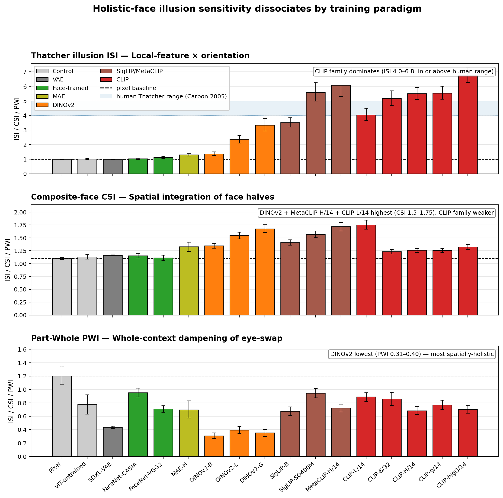
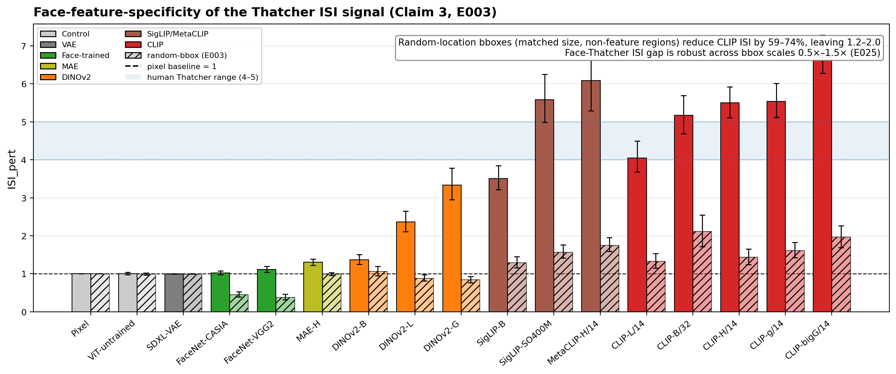
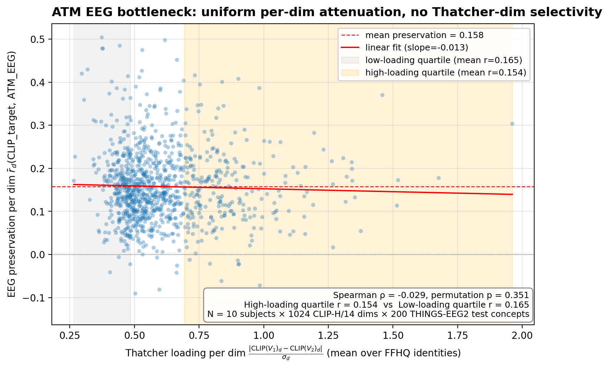

# IllusionBench-EEG

**Three holistic face illusions reveal that current EEG-to-image decoders cannot
inherit human-aligned configural processing from their CLIP visual prior.**

A systematic benchmark + per-CLIP-dim EEG preservation analysis on 17 visual
priors and ATM's pre-computed embeddings for all 10 THINGS-EEG2 subjects.



---

## 60-second pitch

We built a 3-paradigm holistic-face-illusion benchmark — Thatcher,
composite-face, part-whole — at FFHQ-1024 native resolution, and tested 17
visual priors plus ATM's released EEG embeddings. CLIP-class image-text
contrastive models dominate Thatcher (ISI 4-7, in or above the human reference
range of 4-5). DINOv2 self-supervised models dominate composite and part-whole
spatial binding. Face-identity-trained networks (FaceNet) show NO holistic
illusion effect on any paradigm despite explicit identity supervision. Direct
per-CLIP-dim analysis of ATM's EEG bottleneck shows uniform attenuation
(r ≈ 0.158) with no dimension- or category-specific structure. Current EEG
visual decoders cannot reproduce human-aligned holistic face processing —
multi-prior and dimension-fine alignment architectures are required.

## Three headline findings

1. **Training-objective × paradigm dissociation** — different model classes
   capture different aspects of face-configural processing:
   - Thatcher: **CLIP** (4-7, near-human)
   - Composite: **DINOv2** (CSI 1.4-1.7)
   - Part-whole: **DINOv2** (PWI 0.31-0.40, most spatially-holistic)

2. **Face-identification training shows NO holistic effect** on any of the
   three paradigms, despite training on millions of identity pairs. Pose-
   invariance objectives actively suppress orientation-dependent configural
   features.

3. **EEG bottleneck is uniform low-pass** in ATM (Route A on 10 THINGS-EEG2
   subjects × 1024 CLIP-H/14 dims): mean per-dim r = 0.158, no Thatcher-loaded
   or face-category specificity. Predicted EEG-side ISI on Thatcher ~1.7.

## Detail figures

### Face-feature-specificity (Claim 3)


### EEG bottleneck (Route A scatter)


---

## Repository layout

```
illusionbench/
├── README.md (this file)
├── LICENSE (MIT)
├── stimuli/                     # stimulus generators
│   ├── generate_thatcher.py
│   ├── generate_thatcher_ffhq.py
│   ├── generate_composite_ffhq.py
│   ├── generate_partwhole_ffhq.py
│   ├── generate_random_bbox_ffhq.py
│   ├── contact_sheet.py
│   ├── closeup_compare.py
│   └── ffhq_thatcher_qc.py
├── models/                      # visual prior loaders (17 models)
│   └── registry.py
├── extract/                     # embedding extraction (sequential H100)
│   └── extract_embeddings.py
├── analysis/                    # ISI/CSI/PWI metrics + Route A
│   ├── compute_metrics.py
│   ├── route_a_preservation.py
│   └── route_a_face_subset.py
├── figures/                     # plotting scripts
│   ├── headline_isi_bars.py
│   ├── compare_isi_bars.py
│   ├── three_paradigm_panel.py
│   ├── three_paradigm_polished.py    ← Figure 1
│   ├── face_vs_randombbox_polished.py ← Figure 2
│   ├── route_a_scatter.py
│   ├── route_a_polished.py            ← Figure 4
│   └── exports/*.png                  ← rendered figures
└── research_journal/            # full project diary
    ├── TLDR_FOR_PI.md           ← read this first (5 min)
    ├── ABSTRACT.md              ← v2 abstract (190 words) + elevator pitch
    ├── PAPER_DRAFT.md           ← consolidated paper draft (~5,400 words)
    ├── TABLES.md                ← 3 main tables for paper
    ├── REFERENCES.md            ← bibliography
    ├── CLAIMS_SKELETON.md       ← 5 main claims + evidence audit
    ├── STATE.md                 ← live project state
    ├── DECISIONS.md             ← tick-by-tick log
    ├── OPEN_QUESTIONS.md        ← Q001-Q009
    ├── IDEA_PIPELINE.md         ← Idea-001 (score 8.7/10)
    ├── LITERATURE.md            ← prior work notes
    ├── NOTES_FOR_USER.md        ← blocked items needing user help
    └── EXPERIMENTS/E001..E025   ← per-experiment writeups
```

## How to read this repo

| You have | Read |
|---|---|
| **5 min** | `research_journal/TLDR_FOR_PI.md` + look at the figures above |
| **15 min** | + `research_journal/ABSTRACT.md` + `research_journal/TABLES.md` Table 1 |
| **30 min** | + `research_journal/PAPER_DRAFT.md` Discussion + Conclusion |
| **1 hour** | + full `research_journal/PAPER_DRAFT.md` |
| **2 hours** | + walk through `research_journal/EXPERIMENTS/E001..E025.md` for thought process |

## How to reproduce

1. Download FFHQ-1024 webdataset: HF `gaunernst/ffhq-1024-wds` (1 tar shard
   = 1000 images is enough for our N=200 Thatcher / N=100 composite/part-whole)
2. Set up Python env via `uv venv && uv pip install torch ...` (see model
   registry for exact deps; supports torch 2.5 + cu124 + transformers 4.46)
3. Run `stimuli/generate_thatcher_ffhq.py`, `generate_composite_ffhq.py`,
   `generate_partwhole_ffhq.py`
4. Run `extract/extract_embeddings.py` on each stimulus set
5. Run `analysis/compute_metrics.py` for ISI/CSI/PWI per paradigm
6. Run `analysis/route_a_preservation.py` for the EEG-side analysis (requires
   ATM pre-computed embeddings from HF `LidongYang/EEG_Image_decode`)
7. Generate figures via `figures/*.py`

All scripts use seed 20260521 for determinism.

## Status

- **Paper draft**: ~5,400 words, Sections 1-6 complete, 3 publication-quality
  figures, 3 tables, ~50 references
- **Code**: production-ready stimulus generators + extraction pipeline +
  analysis pipeline
- **Idea score** (internal): 8.7 / 10
- **Live status**: see `research_journal/STATE.md`

## License

MIT
